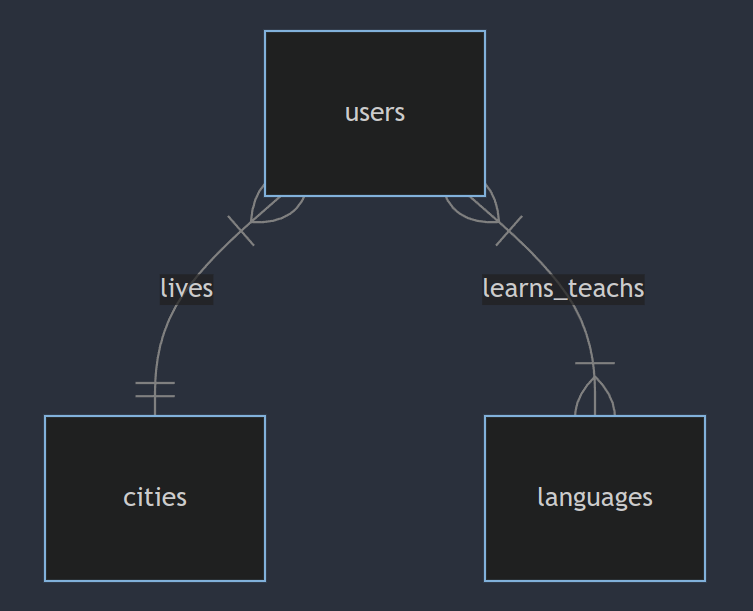

# Design Document

By Angel Gabriel Elias Diaz

## Scope

The database for the Language Exchange project includes all entities necessary to facilitate the process of matching users who want to learn and teach languages. As such, included in the database's scope are:

* Users, including basic identifying information and their location
* Cities, including detailed information about each city
* Languages, detailing which languages are available for learning or teaching
* User preferences, specifically which languages users want to learn and teach
* Friendship connections, tracking the relationships between users
* Potential partners, identifying users who can potentially pair up for language exchange based on their preferences and location

Out of scope are elements like detailed user interaction histories, language proficiency levels, and additional personal attributes beyond the basic ones.

## Functional Requirements

This database will support:

* CRUD operations for users, cities, languages, and friendships
* Tracking user preferences for learning and teaching languages
* Matching users based on their language preferences and location
* Creating and managing friendship connections between users
* Viewing potential partners for language exchange based on mutual interests and location

## Representation

Entities are captured in SQLite tables with the following schema.

### Entities

The database includes the following entities:

#### Users

The `users` table includes:

* `id`, which specifies the unique ID for the user as an `INTEGER`. This column has the `PRIMARY KEY` constraint applied.
* `username`, which specifies the user's username as `TEXT`. A `UNIQUE` constraint ensures no two users have the same username.
* `age`, which specifies the user's age as an `INTEGER`.
* `gender`, which specifies the user's gender as `TEXT`.
* `id_city`, which specifies the ID of the city where the user resides as an `INTEGER`. This column has the `FOREIGN KEY` constraint applied, referencing the `id` column in the cities table to ensure data integrity.

#### Cities

The `cities` table includes:

* `id`, which specifies the unique ID for the city as an `INTEGER`. This column has the `PRIMARY KEY` constraint applied.
* `country`, which specifies the country of the city as `TEXT`.
* `state`, which specifies the state of the city as `TEXT`.
* `city`, which specifies the name of the city as `TEXT`.

All columns in the cities table are required and hence should have the `NOT NULL` constraint applied.

#### Languages

The `languages` table includes:

* `id`, which specifies the unique ID for the language as an `INTEGER`. This column has the `PRIMARY KEY` constraint applied.
* `language`, which specifies the name of the language as `TEXT`. A `UNIQUE` constraint ensures no two languages have the same name.

All columns in the `languages` table are required and hence should have the `NOT NULL` constraint applied.

#### LearningLanguages

The `LearningLanguages` table includes:

* `id`, which specifies the unique ID for the record as an `INTEGER`. This column has the `PRIMARY KEY` constraint applied.
* `id_user`, which specifies the ID of the user who wants to learn the language as an `INTEGER`. This column has the `FOREIGN KEY` constraint applied, referencing the `id` column in the users table to ensure data integrity.
* `id_language`, which specifies the ID of the language the user wants to learn as an `INTEGER`. This column has the `FOREIGN KEY` constraint applied, referencing the `id` column in the languages table to ensure data integrity.

All columns in the `LearningLanguages` table are required and hence should have the `NOT NULL` constraint applied.

#### TeachingLanguages

The `TeachingLanguages` table includes:

* `id`, which specifies the unique `ID` for the record as an `INTEGER`. This column has the `PRIMARY KEY` constraint applied.
* `id_user`, which specifies the ID of the user who wants to teach the language as an `INTEGER`. This column has the `FOREIGN KEY` constraint applied, referencing the `id` column in the users table to ensure data integrity.
* `id_language`, which specifies the ID of the language the user wants to teach as an `INTEGER`. This column has the `FOREIGN KEY` constraint applied, referencing the `id` column in the languages table to ensure data integrity.

All columns in the `TeachingLanguages` table are required and hence should have the `NOT NULL` constraint applied.

#### Friends

The `friends` table includes:

* `id`, which specifies the unique ID for the friendship record as an `INTEGER`. This column has the `PRIMARY KEY` constraint applied.
* `id_user1`, which specifies the ID of the first user in the friendship as an `INTEGER`. This column has the `FOREIGN KEY` constraint applied, referencing the `id` column in the users table to ensure data integrity.
* `id_user2`, which specifies the ID of the second user in the friendship as an `INTEGER`. This column has the `FOREIGN KEY` constraint applied, referencing the `id` column in the users table to ensure data integrity.

All columns in the `friends` table are required and hence should have the `NOT NULL` constraint applied.

### Relationships

The below entity relationship diagram describes the relationships among the entities in the database.

As detailed by the diagram:

* One user can learn multiple languages, and one language can be learned by multiple users.
* One user can teach multiple languages, and one language can be taught by multiple users.
* One user can have multiple friends, and each friend connection involves two users.

## Optimizations

Per the typical queries in `queries.sql`, it is common for users of the database to access potential partners for a specific user. For that reason, indexes are created on the username column in the `users` table to speed up the identification of users by their usernames.

To optimize the retrieval of potential partners based on both `user_1_id` and `user_2_id` columns in the `PotentialPartners` view, these columns are implicitly indexed through the underlying `LearningLanguages` and `TeachingLanguages` tables, facilitating faster lookups and joins on these attributes.

Additionally, considering the common need to filter users by age, an index is created on the `age` column in the users table to expedite age-based searches. This index significantly improves the performance of queries that filter users within a specific age range.

## Limitations

The current schema assumes users will only specify a desire to learn or teach languages without indicating proficiency levels or specific learning goals. Future iterations could include attributes for language proficiency and learning goals.
